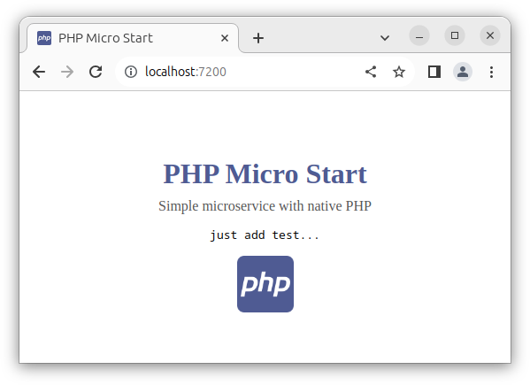

# Micro Start PHP

Simple microservice with native PHP.

Based on `php:8.2.3-apache-buster`. Built image: `405 MB`;
```shell
# run this command to start
make d-up
```

### URL addresses
- main page: `/`
- simple api: `/api`
- static file: `/download/some.txt`

> Just **_click on the logo_** to download a static file.



## Analogs
- Node.js Vanilla: [micro-start-node](https://github.com/phacman/micro-start-node)
- Golang Native: [micro-start-go](https://github.com/phacman/micro-start-go)
- Python Native: [micro-start-python](https://github.com/phacman/micro-start-python)
